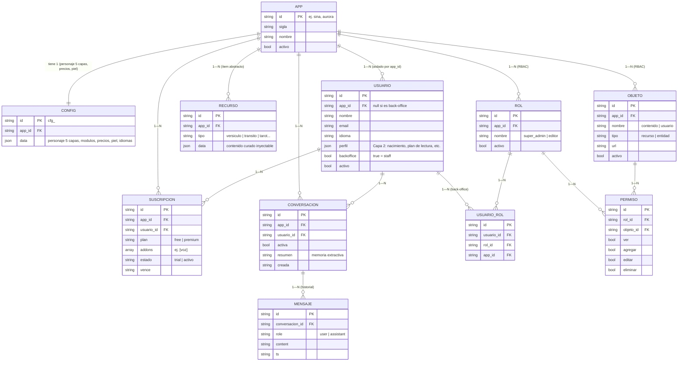

# Modelo de datos — Núcleo AI-first

Modelo **genérico estilo Odoo** (Arquitectura §5): los datos son abstractos y
configurables, **no** cableados a "astrología". Agregar una app o un tipo de
contenido = configurar, no reprogramar el esquema.

> Implementado hoy en memoria (`src/core/db.js`) con la **misma forma** que tendrá
> en PostgreSQL (AWS São Paulo). Se reemplaza por un repositorio SQL manteniendo
> la interfaz `find/insert/update`; el resto del sistema no cambia.

`PK` = clave primaria · `FK` = clave foránea · `JSON` = documento embebido.

## Diagrama entidad-relación

## Lectura rápida por bloques

| Bloque | Entidades | Para qué sirve |
|---|---|---|
| **Multi-tenant** | `APP`, `CONFIG` | Cada app (Sina, Aurora…) es una fila + su JSON de configuración. Agregar app #N = soltar un JSON. |
| **Usuario final** | `USUARIO`, `SUSCRIPCION` | Dueño de sus datos; plan free/premium + add-ons (voz). Aislado por `app_id`. |
| **Conversación / memoria** | `CONVERSACION`, `MENSAJE` | Historial y resumen que el orquestador inyecta como memoria entre turnos. |
| **Conocimiento curado** | `RECURSO` | Ítem abstracto (versículo, tránsito, tarot…) que se **inyecta** para que la IA no invente datos duros. |
| **RBAC (back-office)** | `OBJETO`, `ROL`, `PERMISO`, `USUARIO_ROL` | Permisos del panel de administración: quién ve/edita qué, por app. |

## Reglas clave del esquema

- **Aislamiento multi-tenant:** casi todas las tablas llevan `app_id`. Un usuario de
  una app nunca ve datos de otra (`getUsuario` valida `u.app_id === appId`).
- **Genérico, no específico:** `RECURSO` es un ítem abstracto con `tipo` + `data` (JSON),
  para no rehacer el esquema por cada vertical.
- **Permisos N—N:** un `USUARIO` (staff) tiene roles vía `USUARIO_ROL`; cada `ROL`
  define `PERMISO` (ver/agregar/editar/eliminar) sobre cada `OBJETO`.
