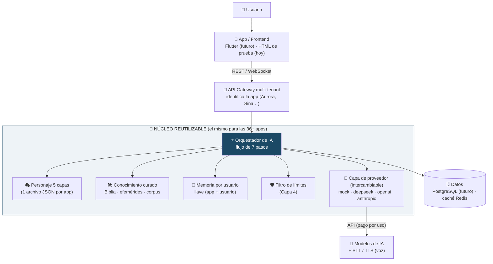
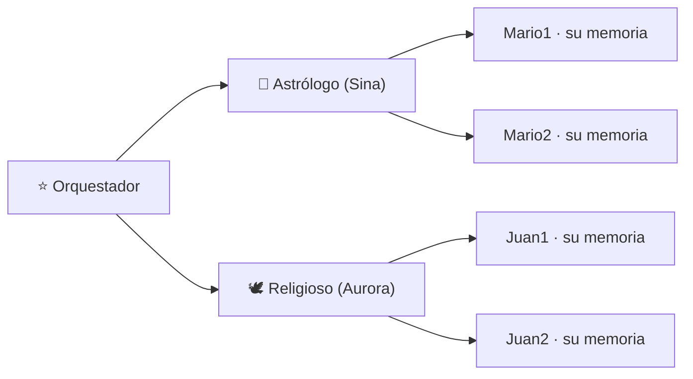

# El modelo del núcleo — diagrama y vista rápida

> Documento visual de acompañamiento. La explicación completa (no técnica) y el plan del siguiente hito están en **[Modelo_Nucleo_y_Hito.pdf](Modelo_Nucleo_y_Hito.pdf)** / **[.docx](Modelo_Nucleo_y_Hito.docx)**.

## Diagrama del núcleo (cómo se conectan las piezas)

## La memoria, separada por (personalidad + usuario)

Cada caja de memoria es independiente: la llave es el **par (app + usuario)**. Validado en **[Validacion_Memoria_Tecnica.pdf](Validacion_Memoria_Tecnica.pdf)**.

## Modelo de datos (relaciones)

El diagrama entidad-relación completo está en **[MODELO_DATOS.md](MODELO_DATOS.md)** (se dibuja solo en GitHub).
